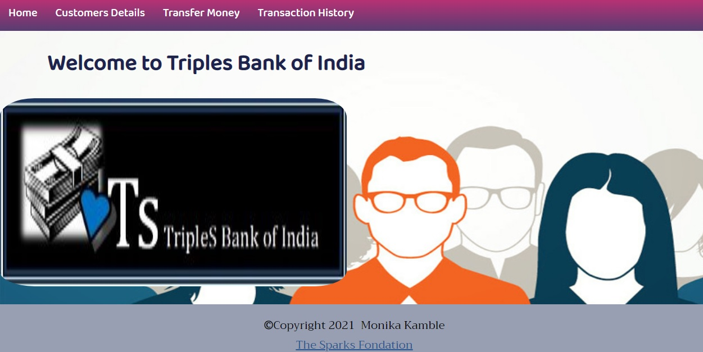
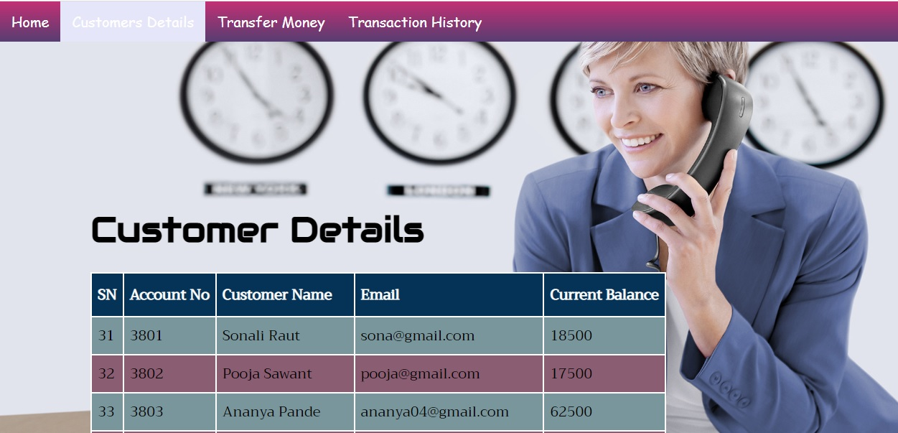
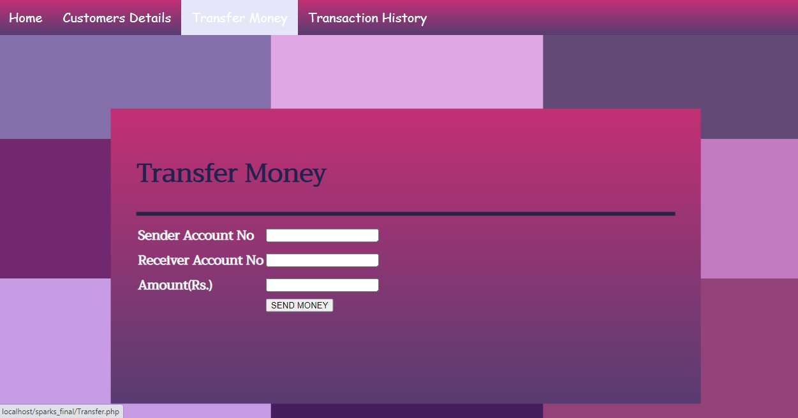
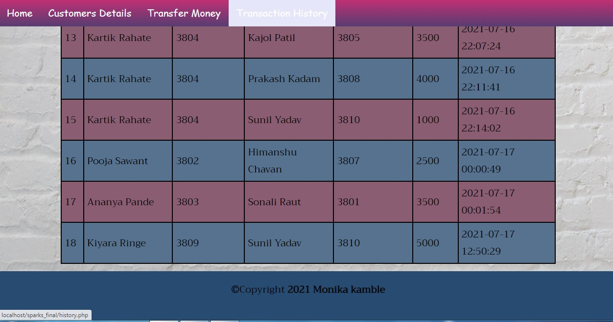

# SparksFoundation_WebDevTask1
Web development &amp; designing task at The Sparks Foundation as an intern July 2021

###Sparks-Foundation_WebDevTask1
Web development &amp; designing task at The Sparks Foundation as an intern #GRIPJULY21
<b>TripleS Bank Of India</b>
During: <b>The Sparks Foundation Internship July 2021</b>
Designed and Developed by: <b>Monika Kamble</b>

Objective of the Project:
To show a Basic Banking System.

Features:
  <ul type="disc">
  <li>Transferring Money from one Customer's Account to another.</li>
  <li>View all the Customers Records.</li>
  <li>View all Transaction History.</li>
  </ul>  

  
  

<h2>Languages and Technologies Used:</h2>
  <ul type="disc">
  <li>HTML</li>
  <li>CSS</li>
  <li>JS</li>
  <li>PHP</li>
  <li>MySQL</li>
  </ul>
